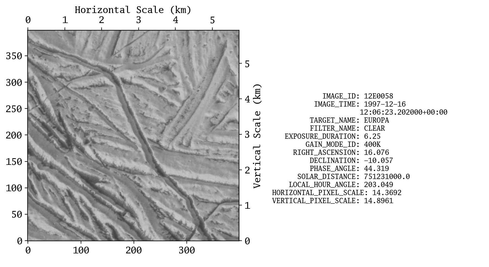
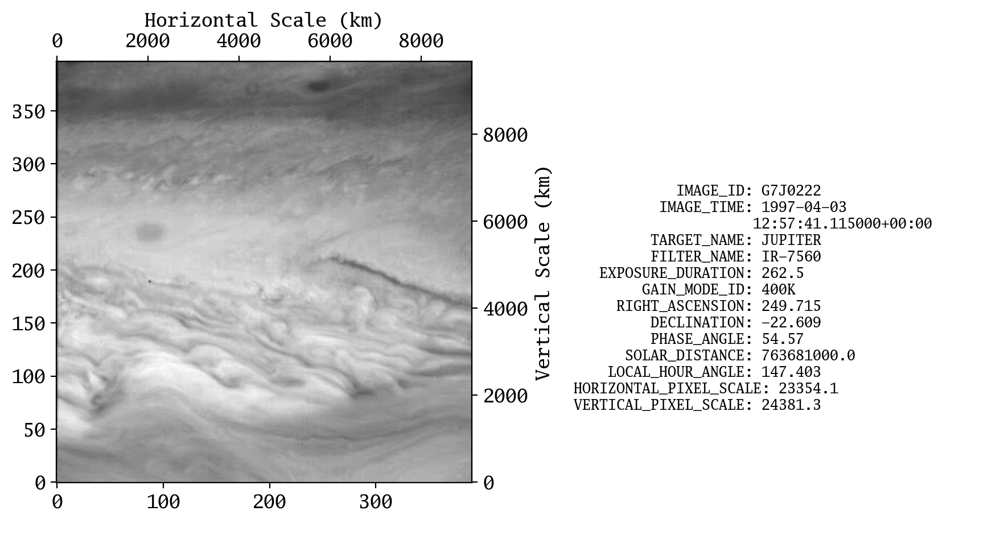
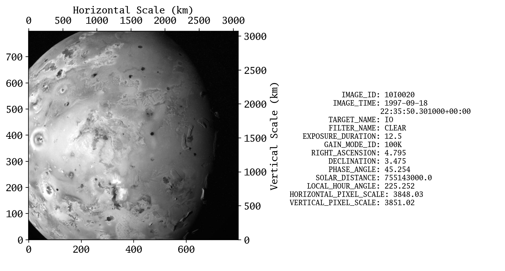

# pds3vir
An extremely simple PDS3 format "VICAR .img file reader" (vir).

It is made for an intern research topic, using Galileo spacecraft data.

We could not simply use [``planetarypy/planetaryimage``](https://github.com/planetarypy/planetaryimage), beacuse it fails to read the Galileo image properly for some reason (decoder issue), so combined it with [``SETI/pds-tools/vicar.py``](https://github.com/SETI/pds-tools).

## Dependency:
- **python >= 3.8**
- numpy
- [``planetarypy/planetaryimage``](https://github.com/planetarypy/planetaryimage)

Influenced by
* ``vicar.py``: A direct copy with small modifications of [``SETI/pds-tools/vicar.py``](https://github.com/SETI/pds-tools) (permalink for the specific commit: [@21dc09c](https://github.com/SETI/pds-tools/blob/3690697fa166a686d6526f195567f180c7593543/vicar.py#L1)).
  * Few differences:
    - Made it as a package.
    - Minor tuning to the internal codes (see "history" of the file).
    - Remove deprecated attributes.


## Install
After cloning this repo (see greeb "code" button at the top right),

```
$ cd <the directory where ``setup.py`` of this repo is located>
$ pip install -e .
```

## Usage
```python
from pathlib import Path
from matplotlib import pyplot as plt
from matplotlib import rcParams

import pds3vir as pds3

rcParams.update({
    'font.family': 'go mono, consolas, courier', 'font.size':12, 'mathtext.fontset':'stix',
})

lblpaths = list(Path("pdsimage2.wr.usgs.gov/").glob("**/*.lbl"))
pds = pds3.open_pds3(lblpaths[0])
#                             ^^^^^
# you can try options such as
#   pds3.open_pds3(lblpaths[0], vicar=False)
# to get wrong result, and
#   pds3.open_pds3(lblpaths[0], cut=False)
# to get the full image with many 0

fig, axs = plt.subplots(1, 2, figsize=(9, 5), sharex=False, sharey=False, gridspec_kw=None)

hkmpp = pds.label["HORIZONTAL_PIXEL_SCALE"]/1000
vkmpp = pds.label["VERTICAL_PIXEL_SCALE"]/1000
# kmpp = km per pixel
axs[0].imshow(pds.image, cmap='gray', origin="lower")
secx = axs[0].secondary_xaxis('top', functions=(lambda x: x*hkmpp, lambda x: x/hkmpp))
secy = axs[0].secondary_yaxis('right', functions=(lambda x: x*vkmpp, lambda x: x/vkmpp))
secx.set_xlabel("Horizontal Scale (km)")
secy.set_ylabel("Vertical Scale (km)")
axs[1].axis("off")

txt = ""
for h in ["image_id", "image_time", "target_name", "filter_name",
          "exposure_duration", "gain_mode_id", "RIGHT_ASCENSION", "declination",
          "phase_angle", "SOLAR_DISTANCE", "LOCAL_HOUR_ANGLE",
          "HORIZONTAL_PIXEL_SCALE", "VERTICAL_PIXEL_SCALE"]:
    val = str(pds.label[h.upper()]).replace(" ", "\n" + " "*21)
    txt += f"{h.upper():>20s}: {val} \n"
axs[1].text(0, 0.2, txt, fontsize=9)

plt.tight_layout()
plt.show();
```

One of the examples:






## General Usage
To extract all the informations from every ``.lbl`` files:
```python
import pandas as pd

keys = []
for fpath in lblpaths:
    with open(fpath, "r") as f:
        for line in f:
            if "=" in line:
                if (k := line.split("=")[0].strip()) not in keys:
                    keys.append(k)
fullinfo = {"file": lblpaths}
fullinfo = {**fullinfo, **{k: [None]*len(lblpaths) for k in keys}}

for i, fpath in enumerate(lblpaths):
    with open(fpath, "r") as f:
        for line in f:
            if "=" in line:
                fullinfo[line.split("=")[0].strip()][i] = line.split("=")[-1].strip()
fullinfo = pd.DataFrame(fullinfo)
fullinfo.to_csv("fullinfo.csv", index=False)
```

To extract only the ``IMAGE_ID`` for quick naviagation:
```python
cols = []
with open("cumindex.lbl", "r") as ff:
    lines = ff.readlines()
    for line in lines:
        if line.strip().startswith("NAME"):
            cols.append(line.split("=")[1].strip().lower())

df = pd.read_csv("cumindex.tab", names=cols)
df = df.replace(["N/A", "UNK"], value=np.nan, regex=True)
df.to_csv("cumindex.csv", index=False)
```
**NOTE**: ``cumindex`` means the cumulative index, since GO_0017. Therefore, you must use ``cumindex`` in the last folder, i.e., GO_0023.